# 🏥 Projet HospitalApplication - ORM JPA Hibernate Spring Data

##  Objectif de l'activité

Mettre en œuvre l'ORM avec **JPA/Hibernate** et **Spring Data JPA** pour créer un mini-projet de gestion de patients. L'activité est ensuite enrichie avec les entités **Médecin**, **Rendez-vous**, **Consultation**, **User** et **Role**, pour illustrer les relations entre entités et la migration de la base de données H2 vers MySQL.

---
## Introduction
Ce projet est une application de gestion d’un hôpital, développée dans le cadre d’une activité pratique dirigée par **Mohamed Youssfi**. L'objectif est de mettre en œuvre une architecture complète utilisant **Spring Boot**, **JPA**, **Hibernate**, **Spring Data**, et **REST API**, afin de modéliser des entités comme les `Patients`, `Médecins`, `RendezVous`, et `Consultations`.

L’application commence avec une base de données embarquée H2, puis migre vers **MySQL** pour un usage plus réaliste.

---

## 🧰 Technologies et outils utilisés

| Technologie      | Rôle |
|------------------|--|
| Java             | Langage principal |
| Spring Boot      | Framework principal |
| Spring Data JPA  | ORM (Mapping Objet-Relationnel) |
| Hibernate        | Implémentation JPA |
| Lombok           | Réduction du code boilerplate |
| H2 Database      | Base de données en mémoire  |
| MySQL            | Base de données relationnelle persistée |
| IntelliJ IDEA Ultimate | IDE de développement                     |

---

## Étapes de Réalisation

### 1. Création du projet Spring Boot

2. Configurez le projet comme suit :
    - Project: Maven
    - Language: Java
    - Spring Boot: 3.4.4
    - Packaging: Jar
    - Java: 21
   
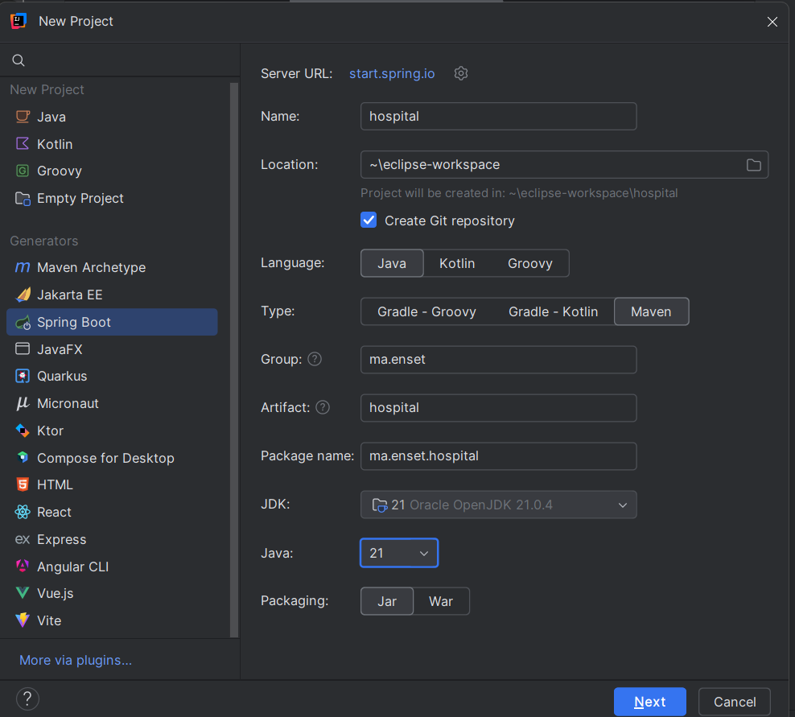

3. Ajoutez les dépendances:
    - Spring Data JPA
    - H2 Database
    - Spring Web
    - Lombok
   
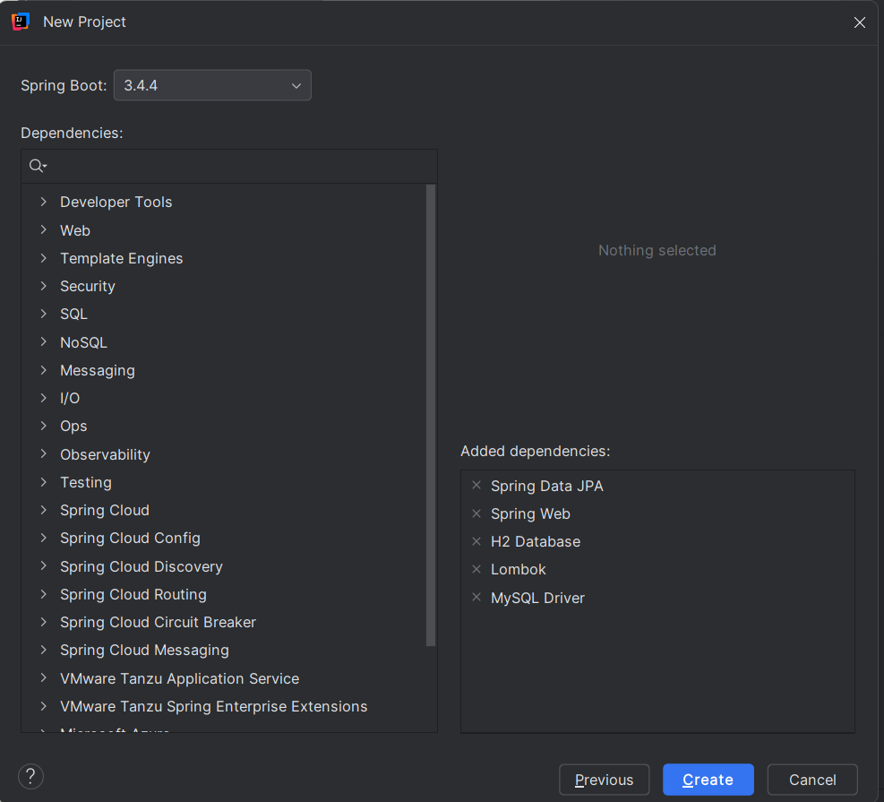

### 2. Diagramme de classes

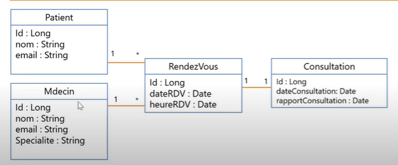

### 2. Architecture du projet

Voici une vue complète de l’architecture du projet :

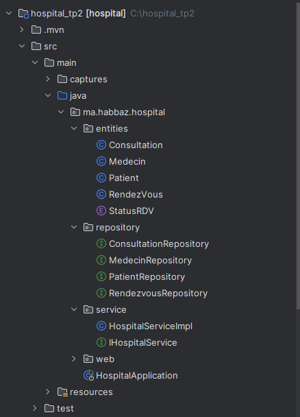

Structure du projet :

```plaintext
ma.enset.hospital
│
├── entities             -> Contient toutes les classes JPA (modèle de données)
│   ├── Patient.java
│   ├── Medecin.java
│   ├── RendezVous.java
│   ├── Consultation.java
│   └── StatusRDV.java (enum)
│
├── repository           -> Interfaces Spring Data JPA (DAO)
│   ├── PatientRepository
│   ├── MedecinRepository
│   ├── RendezvousRepository
│   └── ConsultationRepository
│
├── service              -> Couche service avec la logique métier
│   ├── IHospitalService (interface)
│   └── HospitalServiceImpl (implémentation)
│
├── web                  -> Contrôleurs REST
│   └── PatientRestController
│
└── HospitalApplication  -> Classe principale de démarrage Spring Boot
``` 
    - Rôle des Packages et Classes
> entities : 
Contient les classes d'entité JPA, chacune mappée à une table en base de données :

- Patient: Représente un patient.
  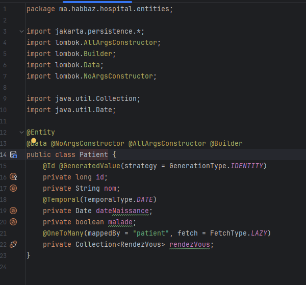

- Medecin: Représente un médecin.
  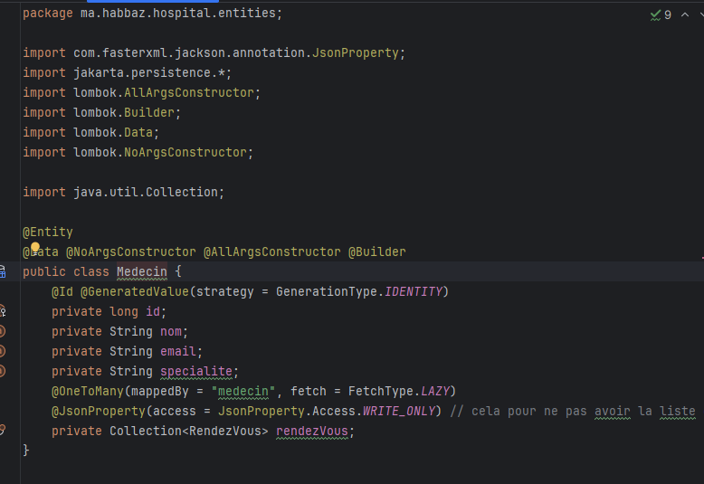

- RendezVous: Une entité pour gérer les rendez-vous, liée à un médecin et un patient.
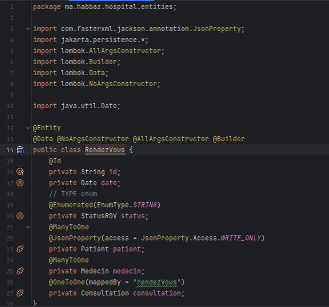

- Consultation: Détails d’une consultation.
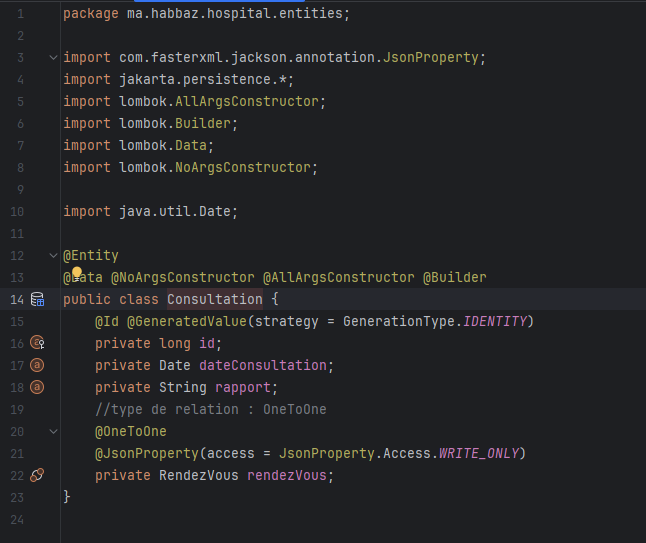

- StatusRDV: Enum qui indique l'état du rendez-vous (PENDING, CONFIRMED, CANCELLED).
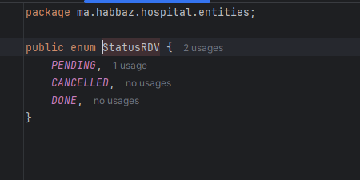

### Explication des annotations
    @Entity: Marque la classe comme une entité JPA
    
    @Id: Spécifie la clé primaire
    
    @GeneratedValue: Configure la stratégie de génération des ID
    
    @Temporal: Précise le format de la date
    
    Lombok annotations (@Data, @NoArgsConstructor, @AllArgsConstructor): Génèrent automatiquement les getters/setters, constructeurs, etc.

> repository
Contient les interfaces Spring Data JPA, pour interagir avec la base de données.

- PatientRepository: CRUD + requêtes personnalisées pour Patient.
  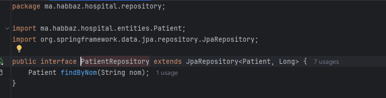

- MedecinRepository: CRUD pour les médecins.
  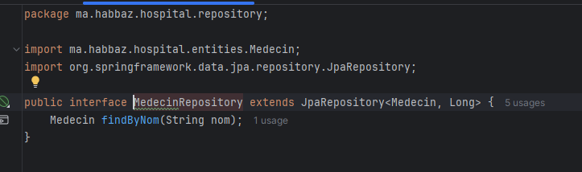

- RendezvousRepository: Pour les rendez-vous.
  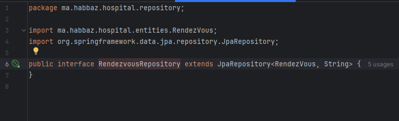

- ConsultationRepository: Pour les consultations.
  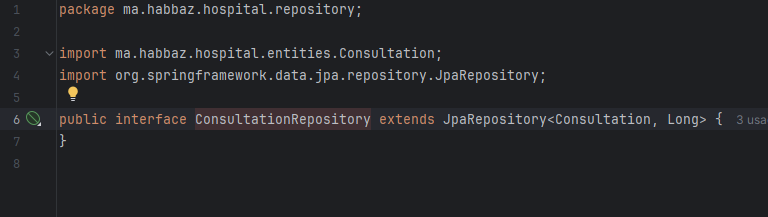

> service
Implémente la logique métier de l’application.

- IHospitalService: Interface qui définit les opérations métier (ajouter patient, rendez-vous...).
  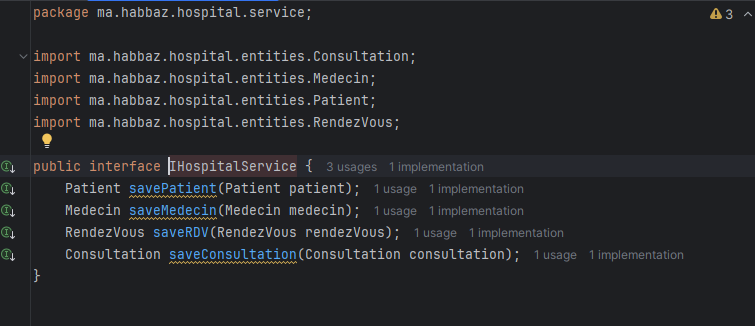

- HospitalServiceImpl: Implémente cette interface avec injection des repositories.
  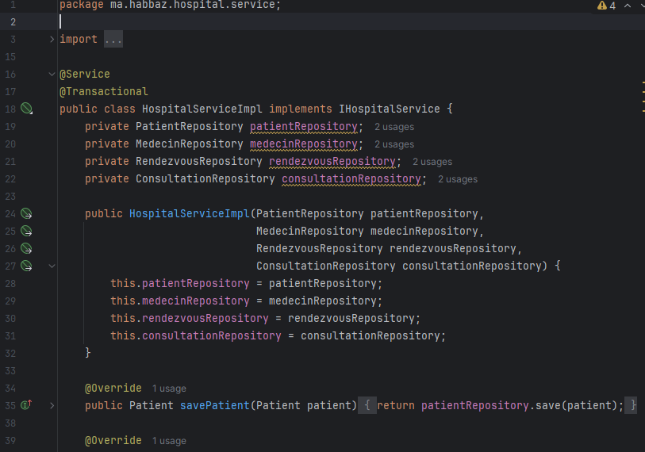
  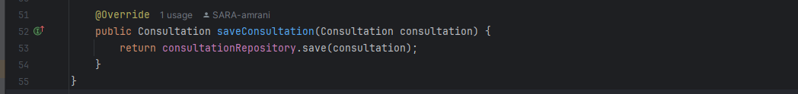

> web
Expose les services via des endpoints REST.

- PatientRestController: Fournit des API REST pour manipuler les entités (GET, POST, DELETE, etc.).
  

### ✅ Exemple de résultat JSON depuis l'endpoint `/patients`


> HospitalApplication
Classe principale annotée avec @SpringBootApplication. Elle exécute le code au démarrage et permet d’injecter des données de test

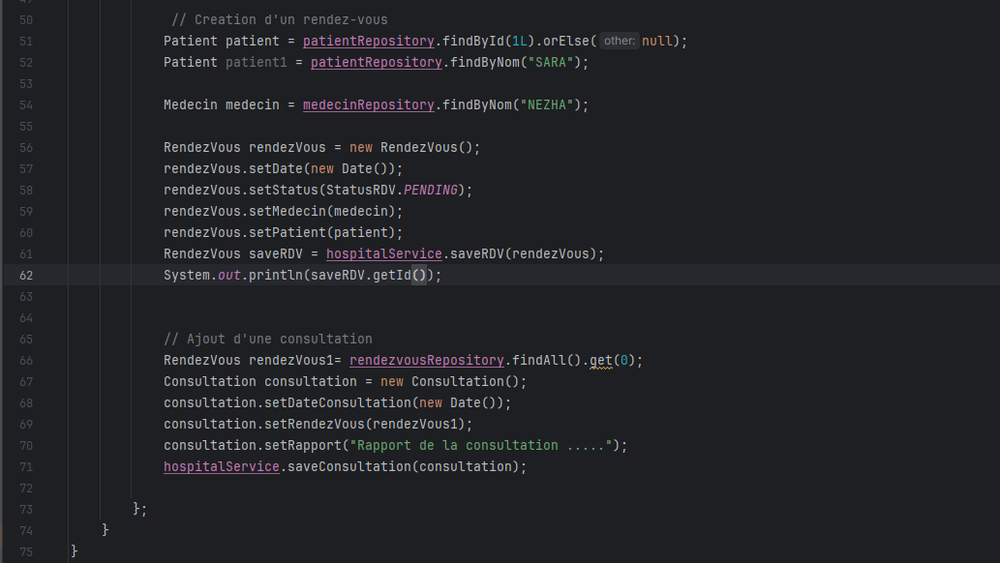


---
### 4. Configuration de l'application

#### Fichier application.properties
Configurez la base de données H2 dans `src/main/resources/application.properties`:


##### Accès à la console H2 :
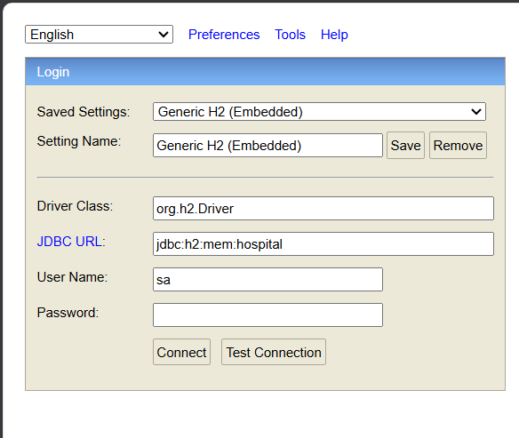
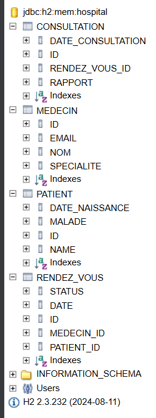


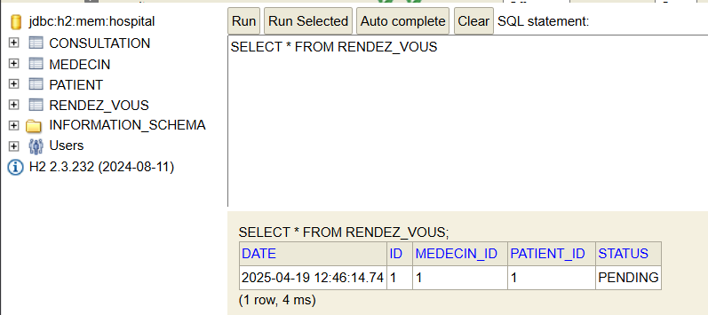


### 5. Migration de H2 vers MySQL
➤ Configuration application.properties
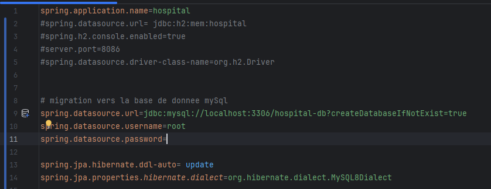

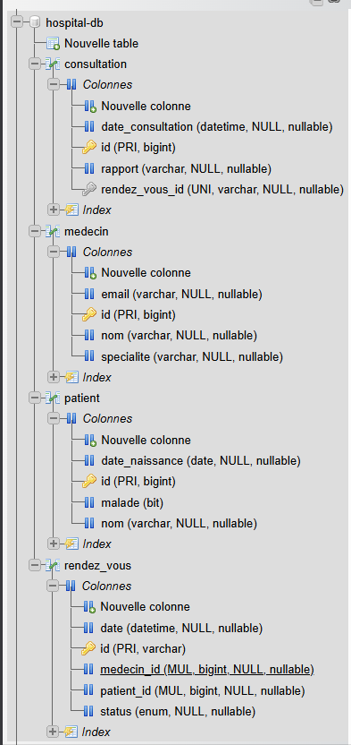

- La table patient


- La table medecin


- La table rendz-vous


- La table consultation


## Conclusion
Ce projet nous a permis de comprendre la puissance de l’écosystème Spring Boot dans la gestion d’une application métier complexe avec persistance de données. Grâce à JPA, Hibernate, et Spring Data, le code est plus clair, concis et performant. Il ouvre également la porte vers des applications plus évoluées avec Spring Security, Thymeleaf, ou encore React/Angular en front-end.

## Remerciements
Merci à M. Mohamed Youssfi pour ses explications claires et ses vidéos très pédagogiques.
https://www.youtube.com/watch?v=cz3p4y7tUEs
## Auteur
Réalisé par : [EL AMRANI SARA]

Date : [Mars 2025]